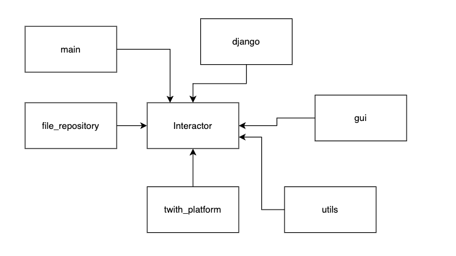

# Краткое описание системы
StreamCropper - это программное решение, позволяющее "нарезчикам" стримов ускорить процесс нарезки интересных моментов.
Главный компонент системы - это Interactor. Интерактор содержит в себе всю логику анализа интересных моментов, "слежкой" за стримами, записи видео потока и чата.
Модуль interactor.stream_analyzer содержит в себе простую логику поиска интересных моментов. Интересным считается тот момент времени, в который было послано много сообщение в чат. Количество этих сообщений называется весом момента

Модуль interactor.stream_watcher содержит в себе логику "наблюдения" за стримерами. Когда стример начинает трансляцию, модуль запускает задачу записи видео потока и чата. Задачи Task реализованы с помощью шаблона компоновщик. Основная задача - это RecordStreamTask() внутри которой находятся другие задачи RecordTwithChatTask и RecordVideoTask.
При создании задачи она помещается в регистр TaskRegistry. Это широкоизвестный объект, через который удобно управлять задачами

# Краткое описание архитектурных решений проекта

С точки зрения архитектуры, между компонентом interactor и twith_platform инвертированы зависимости. Это означает, что Твич является плагином для всего приложения. Если понадобиться добавить в приложение новую стриминговую площадку, исходный код interactor не будет изменяться, а только добавиться новый компонент (youtube_platform).
Также между interactor и file_repository инвертированы зависимости. Если вместо файлов захочется использовать базу данных, или другое устройство ввода/вывода, то это можно будет сделать легко и безболезненно. Такое решение очень важно для качественного тестирования.
Также плагином для приложения является фреймворк Django. Между ним и приложением инвертированы зависимости. При необходимости его можно заменить на другой фреймворк или перестать использовать его. 

# Стек технологий
Для записи стрима используется streamlink и ffmpeg. Для фронтенд части используется React. Для распространения приложения через сеть используется Django+nginx+gunicorn.
Приложение написано по методологии TDD с использованием принципов SOLID и чистой архитектуры.
Оно развернуто на сервере при помощи Jenkins

